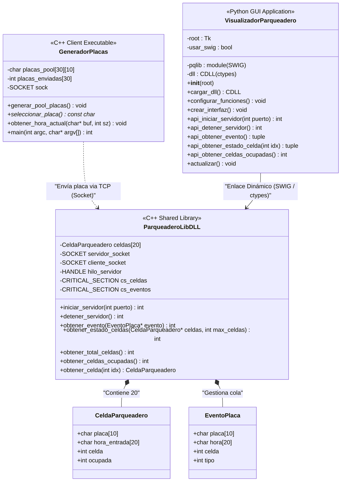
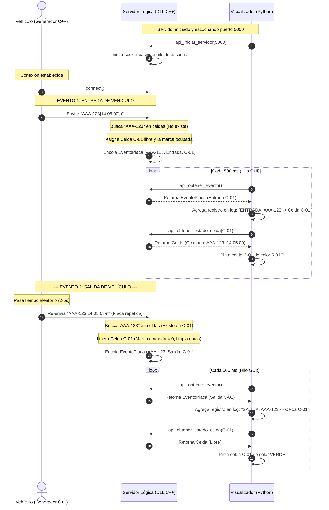

# Sistema de Parqueadero Automatizado

Este proyecto es un sistema distribuido para la gestión y visualización en tiempo real de un parqueadero con **20 celdas**. El sistema está diseñado en una arquitectura Cliente-Servidor empleando Sockets TCP y permite la interoperabilidad de lenguajes entre **C++** y **Python** mediante dos mecanismos de enlace dinámico: **ctypes** y **SWIG**.

## Integrantes del Grupo
* **Yeison Andrés Echavarría Quintero**
* **Sebastián**

---

## 1. Estructura del Proyecto

El proyecto está organizado en las siguientes carpetas y archivos:

```text
parqueadero/
├── src/
│   ├── generador.cpp              # Cliente socket en C++ (Generador de placas)
│   ├── parqueadero_lib.h          # Cabecera de la DLL (Definición de estructuras y funciones)
│   ├── parqueadero_lib.cpp        # Servidor socket y lógica en C++ (DLL)
│   ├── parqueadero_lib_swig.i     # Archivo de interfaz de SWIG para envoltura de Python
│   └── visualizador.py            # Interfaz gráfica en Python (GUI Tkinter)
├── build/                         # Binarios y librerías compiladas (.exe, .dll, .pyd)
├── compilar.bat                   # Script de compilación automática (detecta SWIG)
├── compilar_swig.bat              # Script específico para compilación con SWIG
├── ejecutar.bat                   # Script de ejecución rápida del sistema
├── .gitignore                     # Configuración de exclusiones de Git
└── README.md                      # Documentación del proyecto y diagramas UML
```

---

## 2. Requerimientos de la Rúbrica y Solución Implementada

| Requerimiento | Porcentaje | Estado | Implementación en este proyecto |
| :--- | :---: | :---: | :--- |
| **Funcionalidad** | 15% | **Completo** | El generador de placas envía eventos cada 2-5s. El servidor procesa entradas y salidas de forma automática cuando se repite una placa, y gestiona las 20 celdas. |
| **Comunicación entre PCs** | 25% | **Completo** | Sockets TCP/IP implementados. El cliente (`generador.cpp`) acepta dirección IP y puerto como argumentos de línea de comandos (`generador.exe [IP] [Puerto]`) para permitir la ejecución en PCs distintas dentro de la misma red local. |
| **Librería Dinámica mediante SWIG** | 25% | **Completo** | Se creó el archivo de interfaz de SWIG (`parqueadero_lib_swig.i`). El visualizador en Python (`visualizador.py`) implementa una arquitectura híbrida inteligente: detecta automáticamente si el módulo compilado por SWIG está presente y lo usa; de lo contrario, realiza un fallback transparente a `ctypes`. |
| **Interfaz Gráfica de Disponibilidad** | 15% | **Completo** | GUI en Tkinter que muestra un plano visual de las 20 celdas en tiempo real (Verde = Libre, Rojo = Ocupada con placa y hora), un contador numérico, y un log detallado de eventos. |
| **Git, Documentación, UML** | 20% | **Completo** | Repositorio Git inicializado con manejo de ramas (`main` y `feature`), exclusión de binarios en `.gitignore`, manual técnico detallado, y diagramas UML integrados en Markdown. |

---

## 3. Diagramas UML

### Diagrama de Clases (Arquitectura del Sistema)

El siguiente diagrama detalla la relación entre los componentes de C++ (Generador y DLL de lógica) y el Visualizador en Python, ilustrando las estructuras de datos y cómo interactúan las APIs expuestas:



### Diagrama de Secuencia (Flujo de Entrada y Salida)

Este diagrama muestra el flujo temporal de eventos desde que el generador crea una placa, pasa por los sockets TCP, se almacena en la DLL, y es leída por la GUI en Python para actualizar la pantalla:



---

## 4. Manual de Compilación

### Opción A: Compilación Automática (Recomendada)
Haga doble clic sobre el archivo `compilar.bat` en la raíz del proyecto. Este script realizará lo siguiente:
1. Compilará la librería dinámica base (`parqueadero_lib.dll`).
2. Compilará el generador de placas (`generador.exe`).
3. Buscará si `swig.exe` está disponible en la terminal/PATH. Si lo encuentra, compilará el módulo de SWIG (`_parqueadero_lib_swig.pyd`) automáticamente. Si no lo encuentra, mostrará un aviso de advertencia y completará la compilación del sistema base (el visualizador seguirá funcionando perfectamente usando ctypes).

### Opción B: Compilación Manual con SWIG
Si desea compilar manualmente con SWIG en Windows usando MinGW/TDM-GCC:

1. **Requisito**: Tener `swig.exe` instalado y agregado al PATH de Windows (descargable desde [swig.org](http://www.swig.org/download.html)).
2. Ejecute el script `compilar_swig.bat` o ejecute los siguientes comandos en la terminal cmd:
   ```cmd
   :: Generar wrappers C++ a partir del archivo de interfaz .i
   swig -python -c++ -o src\parqueadero_lib_swig_wrap.cpp src\parqueadero_lib_swig.i

   :: Compilar el wrapper C++ junto con la logica en el modulo .pyd para Python
   :: Reemplazar C:\Path\To\Python con la ruta de su instalacion de Python (ej: C:\Users\user\AppData\Local\Programs\Python\Python314)
   g++ -shared -o src\_parqueadero_lib_swig.pyd src\parqueadero_lib.cpp src\parqueadero_lib_swig_wrap.cpp -I"C:\Path\To\Python\include" -L"C:\Path\To\Python\libs" -lpython3 -lws2_32 -static -DBUILDING_DLL
   ```

---

## 5. Manual de Ejecución

### Ejecución Local (En la misma PC)
1. **Iniciar el Servidor**:
   * Ejecute el archivo `ejecutar.bat` o inicie la interfaz gráfica ejecutando en la consola:
     ```cmd
     py src\visualizador.py
     ```
   * En la ventana gráfica, haga clic en el botón **"INICIAR SERVIDOR"**. Verá que el estado cambia a "Servidor activo" e indicará en los corchetes qué enlace se cargó (ej. `[SWIG]` o `[ctypes]`).
2. **Iniciar el Cliente**:
   * Si usó `ejecutar.bat`, presione cualquier tecla en la terminal para lanzar el generador.
   * Si ejecuta manualmente, abra otra terminal y ejecute:
     ```cmd
     build\generador.exe
     ```
   * El generador se conectará e iniciará el envío aleatorio de placas.

### Ejecución en Red (Comunicación entre 2 PCs diferentes)
El sistema está completamente preparado para sustentaciones en donde el visualizador/servidor corre en un PC y el generador/cliente corre en otro PC diferente de la red local:

1. **En la PC del Servidor (Visualizador)**:
   * Conecte ambas PCs a la misma red (WiFi o cable ethernet).
   * Obtenga la dirección IP local de esta PC (abra una consola cmd y escriba `ipconfig`). Anote la dirección IPv4 (ej. `192.168.1.45`).
   * Ejecute el visualizador (`py src\visualizador.py`) e inicie el servidor haciendo clic en **"INICIAR SERVIDOR"**.
2. **En la PC del Cliente (Generador)**:
   * Copie el ejecutable compilado `build/generador.exe` a la PC cliente.
   * Abra una terminal de comandos en la carpeta donde copió el ejecutable.
   * Ejecute el generador pasando la **IP del servidor** y el **puerto** como parámetros:
     ```cmd
     generador.exe 192.168.1.45 5000
     ```
   * El generador se conectará a través de la red local al visualizador y los eventos se transmitirán y pintarán en tiempo real de PC a PC.

---

## 6. Historial de Git y Manejo de Ramas

El repositorio Git del proyecto implementa una metodología limpia de trabajo basada en ramas para organizar el código:

* **`main`**: Rama estable y lista para entrega, que contiene el código final funcional con el visualizador adaptativo (SWIG + ctypes), documentación y UML.
* **`feature/documentacion-y-uml`**: Rama de desarrollo dedicada a redactar este manual técnico y generar los diagramas arquitectónicos UML.

### Visualización del Historial de Git
Para revisar el historial completo del proyecto y el flujo de fusión entre ramas en su terminal, puede ejecutar:
```cmd
git log --oneline --graph --all
```
Muestra un árbol de confirmaciones limpio como el siguiente:
```text
*   [Commit de fusión] merge: fusionar documentacion y diagramas UML
|\  
| * [Commit en feature] docs: agregar README detallado con arquitectura, manual de uso y diagramas UML
|/  
*   [Commit inicial] feat: implementacion del sistema de parqueadero con ctypes, soporte SWIG y multi-PC
```
